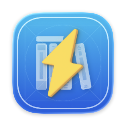

<p></p>

# BoltOSS

Bolt is an offline API documentation browser inspired by [Dash for macOS](https://kapeli.com/dash), specifically designed and built for iOS and iPadOS.

This repository hosts the open-source code that Bolt builds upon.

## Releases

[Get Bolt on TestFlight](https://testflight.apple.com/join/aKwVv7Cv)

This project is in the early development process and the official release will be available soon on AppStore.

[As with the consent from Kapeli](https://blog.kapeli.com/dash-for-ios-android-windows-or-linux), to download and use Dash docsets, please get Bolt from AppStore or TestFlight. For platforms other than iOS and iPadOS, check out [Dash](https://kapeli.com/dash) or [Zeal](https://github.com/zealdocs/zeal) or [Velocity](https://velocity.silverlakesoftware.com) instead.

Releases will be tagged or branched, but no binary artifacts will be provided.

## Build instructions

We support building for up to the two most recent major versions of iOS and iPadOS and the most recent major version of Mac Catalyst, so currently it can be run on iOS 18, iPadOS 18, and Mac Catalyst 26 (macOS 26).

Mac Catalyst builds are only for development and testing, so only major issues will be solved.

Only the latest non-beta release of Xcode is supported. Build with the latest Xcode 26 if you encounter any issues.

To checkout and build, use the following commands:

```sh
mkdir Bolt
git clone git@github.com:BoltDocs/BoltOSS.git Bolt
cd Bolt
git submodule update --init --recursive
sh developer-setup.sh
open Bolt.xcodeproj
```

## License

This software is licensed under the terms of the Apache License Version 2.0 (Apache-2.0), unless otherwise stated. Full text of the license is available in the [LICENSE](LICENSE) file and [online](https://www.apache.org/licenses/LICENSE-2.0).

Some source code in this project may be under different licenses (such as MPL). Please refer to the individual source files or license files for specific licensing information.
